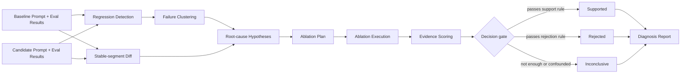
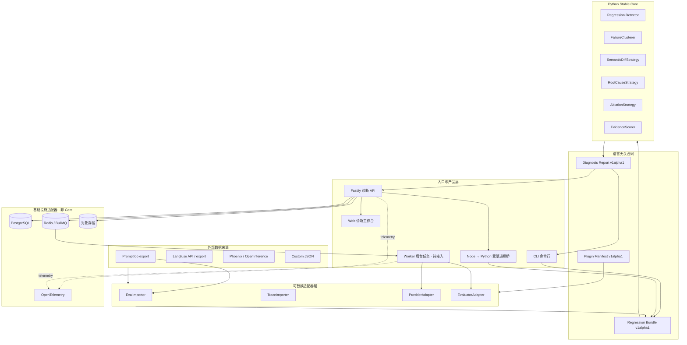
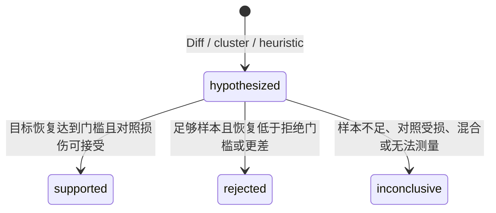

# Prompt Regression Studio 技术架构

本文描述项目的目标架构，也明确当前代码已经做到哪里。它不是“所有方框都已实现”的宣传图。

## 1. 一句话定位

Prompt Regression Studio 的核心是一个**评测之后的诊断层**：它接收同一批测试题上基线 Prompt 与候选 Prompt 的评测结果，找出退化现象，提出“可能是哪段 Prompt 引起”的假设，再通过只改变一个因素的消融实验收集证据。

它不替代 Promptfoo、Langfuse 或 Phoenix：

- Promptfoo 更擅长发起和编排评测；
- Langfuse 更擅长记录线上调用、Trace（调用链）和实验；
- Phoenix 更擅长可观测性、Trace 与评测分析；
- 本项目专注“已经发现退化以后，如何用受控实验解释退化”。

## 2. 关键术语（通俗解释）

| 术语                        | 通俗解释                                                           |
| --------------------------- | ------------------------------------------------------------------ |
| Baseline（基线）            | 旧版本，作为比较参照。                                             |
| Candidate（候选）           | 想验证的新 Prompt 版本。                                           |
| Regression（退化）          | 新版本在相同测试条件下变差。                                       |
| Failure Cluster（失败聚类） | 把表现相似的失败题归成一组，便于找共同原因。                       |
| Semantic Diff（语义差异）   | 不只比较字符，而是按有稳定 ID 的 Prompt 片段记录增加、删除和改写。 |
| Hypothesis（假设）          | “某个改动可能造成某组失败”的待验证说法，不是结论。                 |
| Ablation（消融）            | 只撤销或替换一个改动，其他条件保持不变，再跑一次。                 |
| Control Cases（对照用例）   | 本来没有退化的题，用来检查修复是否伤害其他能力。                   |
| Evidence Gate（证据门槛）   | 预先写好的判定规则，防止看到一点改善就宣布找到原因。               |
| Adapter（适配器）           | 把外部系统的数据翻译成项目统一格式的“转换插头”。                   |
| Stable Core（稳定核心）     | 不依赖网页、数据库和模型厂商的核心规则与算法。                     |

## 3. 端到端流程



关键规则：Diff、相似性、聚类和 LLM 解释都只能生成假设。只有链接到受控消融运行、目标用例和对照用例的证据，才能改变假设状态。

## 4. 总体组件架构



依赖方向必须始终朝向 Core：外部插件可以依赖 Core 的公开类型，Core 不能反过来依赖 OpenAI SDK、数据库 ORM、Fastify、React、BullMQ 或任何评测平台 SDK。

## 5. 当前已经实现什么

| 能力                            | 当前状态               | 说明                                                                            |
| ------------------------------- | ---------------------- | ------------------------------------------------------------------------------- |
| `v1alpha1` 输入/报告/插件合同   | 已实现第一版           | JSON Schema、Python 严格解析器和跨语言 Ajv 校验共同约束边界。                   |
| Python Stable Core              | 已实现第一条纵向链路   | 仅使用 Python 标准库，没有厂商或基础设施依赖。                                  |
| 成对退化检测                    | 已实现                 | 同一个 TestCase 比较 Baseline 与 Candidate；支持通过状态退化及主指标跌幅。      |
| 失败聚类                        | 已实现确定性基线       | 优先使用导入数据中的明确 `failure_mode`，否则按主指标分组；还不是语义向量聚类。 |
| Prompt 片段 Diff                | 已实现                 | 用稳定 Segment ID 识别新增、删除、改写。                                        |
| 根因假设                        | 已实现规则基线         | 标签重叠只负责排序，输出明确写明“不是因果结论”。                                |
| 单片段回退消融                  | 已实现计划与 Mock 回放 | 当前只读取输入包中明确保存的 fixture 结果，不调用或模拟真实 LLM。               |
| 证据门槛                        | 已实现                 | 检查目标恢复、最小样本、最坏单例对照损伤、硬失败恢复和新对照失败。              |
| CLI                             | 已实现                 | `validate` 校验输入；`diagnose` 生成确定性 JSON 或 Markdown 报告。              |
| 可重复与状态机测试              | 已实现基础覆盖         | 包括支持、拒绝、不确定、缺失 fixture、无退化和输入错误。                        |
| Plugin SDK                      | 已实现 alpha           | 严格清单、Core 版本范围和默认拒绝的显式信任加载；它不是安全沙箱。               |
| Promptfoo importer              | 已实现 v3              | 严格成对导入并保留来源；不会把执行错误伪装成普通低分。                          |
| Langfuse/OpenInference importer | 未实现                 | 下一阶段继续通过独立适配器加入，不进入 Core。                                   |
| 真实 Provider 与真实消融执行    | 未实现                 | 当前不产生假模型结果。                                                          |
| HTTP 诊断 API                   | 已实现同步入口         | 有固定命令、stdin 传输、超时、取消、大小与并发边界；尚未持久化或异步化。        |
| Web 诊断工作台                  | 已实现持久化闭环       | 支持上传/粘贴、取消/重试、证据报告、历史刷新和重新打开；暂无逐 case 下钻。      |
| 数据库诊断持久化                | 已实现第一版           | 保存不可变输入、运行状态、报告或安全失败；异步恢复、保留策略和租户隔离待完成。  |
| 第一层部署安全                  | 已实现                 | 部署级 Token、限流、安全响应头、请求大小限制、日志脱敏和本机数据端口已加入。    |
| 用户权限与多租户                | 未实现                 | 尚无账号、RBAC、项目所有权与租户隔离，不可作为开放注册的多人 SaaS。             |

## 6. Stable Core 内部结构

```text
packages/python/core/
  src/prompt_regression_core/
    model.py       # 第一等领域对象（系统里的正式“名词”）
    parsing.py     # 输入校验及跨对象一致性规则
    ports.py       # 所有可替换能力的接口
    strategies.py  # 第一版确定性算法与显式 fixture runner
    pipeline.py    # 按顺序编排诊断，并核对每一步引用关系
    canonical.py   # 规范 JSON、SHA-256 内容哈希、稳定 ID
    cli.py         # 很薄的命令行入口
    reporting.py   # 面向人审阅的确定性 Markdown 报告
  tests/           # 无真实 LLM 也能完整运行的测试
```

`model.py` 定义 Project、Prompt、PromptVersion、PromptSegment、PromptChange、Dataset、TestCase、EvalRun、EvalResult、MetricResult、Regression、RegressionCase、FailureCluster、RootCauseHypothesis、AblationPlan、AblationVariant、AblationRun、Evidence 和 DiagnosisReport。

这些对象拥有稳定 ID，报告通过 ID 把“哪一条失败、哪一处 Prompt 改动、哪一个假设、哪次消融、哪份证据”连在一起。

## 7. 数据合同与可重复性

Canonical Bundle（统一数据包）是 Core 与外界的唯一正式边界。数据库行、HTTP DTO 或某个平台的导出结构都不能直接进入算法。

输入包必须满足：

- Baseline 和 Candidate 引用同一个 Dataset；
- 两侧的模型参数快照和评测器快照必须完全相同，防止把模型或评分标准变化误算成 Prompt 影响；
- 两次 EvalRun 必须恰好覆盖同一组 TestCase，不能悄悄少题或多题；
- 每条结果必须包含配置的主指标；
- PromptVersion 的 Segment ID 与 ordinal 不重复；
- 如果提供 `content_hash`，必须与规范化后的片段内容相同；
- NaN、Infinity、无时区时间、重复 ID、错误引用会明确失败；
- Mock 消融结果必须显式存在并覆盖完整数据集，否则不产生证据。

输出报告包含输入包 SHA-256、引擎版本和配置哈希。相同输入与相同 Core 版本会产生字节一致的规范 JSON。

评测集构建属于 Core 之前的应用流程：用户可手工录入或导入用例；AI 未来可以提出候选用例，但必须记录生成模型、生成 Prompt、来源、synthetic 标签和审核状态。只有审核、去重并发布后的不可变 DatasetVersion 才能进入 Baseline/Candidate 比较。AI 生成测试题不能同时替自己生成评分结果。

## 8. 证据状态机



Phase 1 使用简单但可审计的成对均值规则：

- `target_mean_delta`：消融版本相对 Candidate 在退化用例上的平均变化；
- `recovery_ratio`：恢复量 ÷ Baseline 与 Candidate 的原始差距；
- `control_mean_delta`：消融版本相对 Candidate 在非退化用例上的平均变化；
- `max_observed_control_damage`：对照组里最严重的单例损伤，避免正负变化在平均数中互相抵消；
- `unrecovered_hard_targets`：基线通过、候选失败，且消融后仍失败的目标数量；
- `new_control_failures`：消融操作新造成的对照失败数量；
- 支持、拒绝、最小目标/对照样本数和最大对照损伤门槛均来自输入配置，并进入配置哈希。任何硬目标未恢复或出现新对照失败，都不能标为 `supported`。

这不是显著性检验，也不代表对所有数据和模型都成立。后续统计插件可以加入 Bootstrap（重复抽样估计区间）、置换检验、分层分析和多重检验修正，但必须保留相同 Evidence 链路。

## 9. 插件扩展点

Core 当前公开以下 Python Protocol（接口约定）：

- `EvalImporter`：导入外部评测结果；
- `TraceImporter`：导入调用链证据；
- `ProviderAdapter`：调用一个模型生成回答；
- `EvaluatorAdapter`：把回答转成统一评分；
- `FailureClusterer`：给失败分组；
- `PromptParser`：把原始 Prompt 切成稳定片段；
- `SemanticDiffStrategy`：比较两个 Prompt 版本；
- `RootCauseStrategy`：提出可验证假设；
- `AblationStrategy`：设计只改变受检因素的实验；
- `EvidenceScorer`：按版本化规则判定证据；
- `Reporter`：把结构化报告渲染成不同格式。

Alpha Plugin SDK 已实现严格清单、Core 半开版本范围、能力声明和默认拒绝的显式加载。第三方插件与应用同进程执行时等于运行任意代码；当前信任确认只是防误用，不是沙箱。不受信插件仍必须放到受限进程或容器中。稳定 SDK 之前还需要权限声明、签名/来源策略、跨版本合同测试和隔离宿主。

## 10. 技术栈、职责与是否需要改变

| 技术                 | 负责什么（通俗解释）                 | 当前判断                             | 需要增加或替换的条件                                                    |
| -------------------- | ------------------------------------ | ------------------------------------ | ----------------------------------------------------------------------- |
| Python 3.12 标准库   | 核心诊断规则、CLI 和确定性测试       | 保留，是 reference core              | 统计需求成熟后增加 NumPy/SciPy 等可选 extra，不让简单运行被重依赖绑住。 |
| JSON Schema 2020-12  | 规定跨语言文件“长什么样”             | 保留                                 | 发布稳定版前增加自动生成类型、兼容性测试与迁移器。                      |
| TypeScript           | Web/API/Worker 与未来 TS SDK         | 保留                                 | 不把科学计算规则复制成第二套；通过合同调用 Python Core。                |
| React + Vite         | 非技术用户操作页面                   | 保留，持久化诊断已接通               | 下一步增加逐 case 下钻、E2E、可访问性基线与长列表虚拟化。               |
| Fastify              | HTTP 接口与权限边界                  | 同步入口、部署级鉴权和资源防护已接通 | 下一步增加账号权限、幂等任务和异步排队；Core 仍不依赖它。               |
| PostgreSQL + Drizzle | 保存项目、版本、运行、证据和审计关系 | 初始迁移与诊断记录已加入             | 下一步演练升级、备份恢复和租户隔离；不能成为 CLI/Core 的强依赖。        |
| Redis + BullMQ       | 排队运行耗时的真实评测/消融          | 作为 Worker adapter 保留             | 任务要幂等、可取消、可恢复；Redis 不是事实数据库。                      |
| OpenTelemetry        | 统一 Trace 和运行观测                | 尚未加入，Beta 前需要                | 只在入口和适配器注入，不让遥测 SDK 污染领域模型。                       |
| S3 兼容对象存储      | 保存大型输入、输出、Trace 和报告包   | 观察到体积压力再加入                 | 小规模阶段可先保存文件或 PostgreSQL 引用。                              |
| ClickHouse           | 大规模 Trace 分析                    | 现在不增加                           | 只有 PostgreSQL 经索引/分区后仍有明确瓶颈才加入。                       |

当前最需要改变的不是换框架。TypeScript 产品层已经通过版本化 Bundle 调用 Core，并保存同步诊断记录；下一步是把同步入口升级为可恢复的异步任务，补齐更多真实 importer、受控 Provider/Evaluator、保留策略和安全边界。

## 11. 推荐部署演进

当前支持本地 CLI，以及受限并发的同步 Server 入口：

```text
JSON bundle -> Python Core -> JSON report
HTTP request -> Fastify -> constrained Python process -> JSON report
```

团队服务阶段采用模块化单体加独立 Worker：

```text
React Web -> Fastify API -> PostgreSQL
                     |-> Redis/BullMQ -> Worker -> Provider/Evaluator adapters
                     |-> Python Core process -> Diagnosis Report
```

只有出现不同团队所有权、独立扩容或故障隔离的实测需求，才把 Provider Gateway、Diagnosis Engine 或 Trace ingestion 拆成服务。微服务数量不是成熟度指标。

## 12. 安全和运营底线

公开 Beta 之前至少需要：

- 登录、项目级权限和每个数据库查询的租户边界；
- 模型密钥加密、脱敏、轮换，且绝不返回网页；
- 外部 URL 防 SSRF（防止服务器被诱导访问内网）；
- Prompt/回答/Trace 的敏感信息处理与可配置保留期；
- API、队列任务和模型调用的限流、超时、重试分类与费用上限；
- 追加式审计日志、备份恢复演练、数据库迁移回滚说明；
- 依赖/Secret 扫描、SBOM（软件物料清单）和签名发布物；
- Core、Schema、插件与导入器兼容矩阵。

在这些控制完成前，项目状态保持 pre-alpha，只能在受信任的本地或隔离环境使用。

相关决策见 [`docs/adr/`](./adr/)，第三方代码边界见 [`THIRD_PARTY_NOTICES.md`](../THIRD_PARTY_NOTICES.md)。
